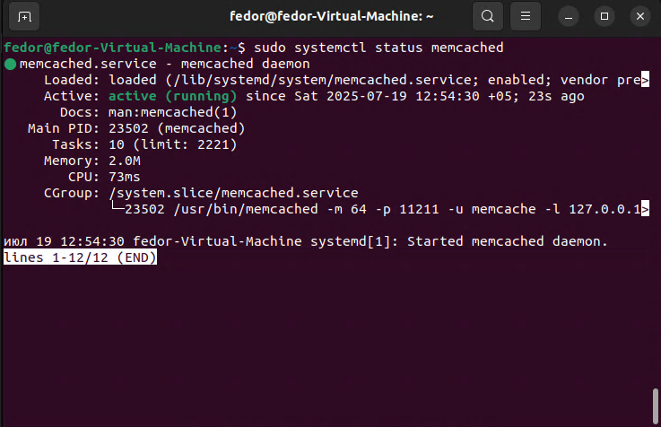
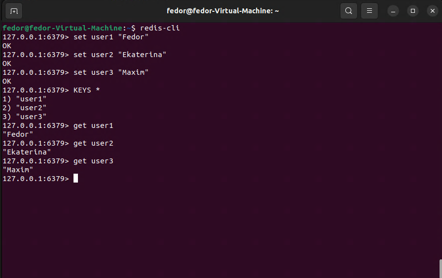
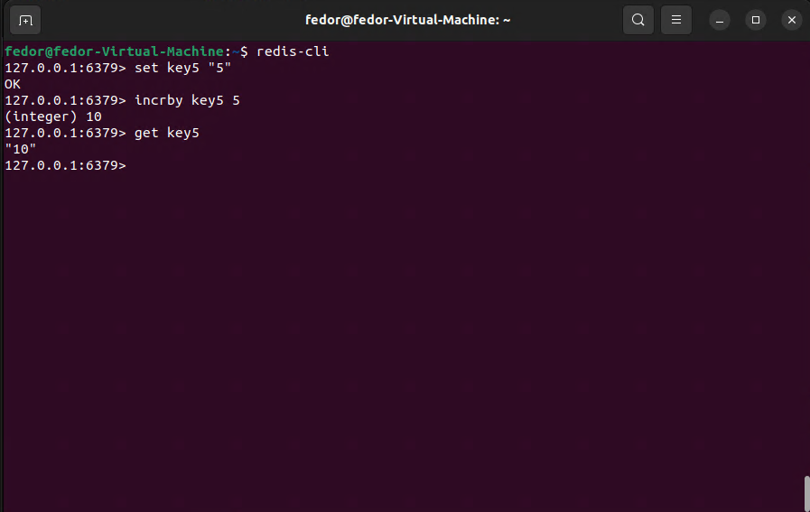

# Redis# Домашнее задание к занятию «Кеширование Redis/memcached»

### Задание 1. Кеширование 

Приведите примеры проблем, которые может решить кеширование. 

*Приведите ответ в свободной форме.*

---

Кеширование помогает решать следующие проблемы:
1. Снижение нагрузки на базу данных: Кеширование часто запрашиваемых данных (например, профилей пользователей или информации о товарах) уменьшает количество запросов к базе данных, ускоряя отклик системы.
2. Ускорение работы приложений: Сохранение результатов сложных вычислений или запросов в кеше позволяет избежать повторной обработки, ускоряя ответы.
3. Обработка пиков трафика: Кеширование статичного или полустатичного контента (например, веб-страниц или ответов API) помогает справляться с резкими скачками трафика без перегрузки серверов.
4. Снижение задержек: Хранение данных в быстром доступе (например, в оперативной памяти с помощью Redis или Memcached) уменьшает время на получение данных из медленных хранилищ.
5. Экономия ресурсов: Кеширование снижает потребность в дорогих ресурсах базы данных или вычислений, уменьшая затраты.
6. Улучшение пользовательского опыта: Быстрый доступ к данным сокращает время загрузки страниц и делает взаимодействие с приложением более плавным.

    

### Задание 2. Memcached

Установите и запустите memcached.

*Приведите скриншот systemctl status memcached, где будет видно, что memcached запущен.*

---

### Задание 3. Удаление по TTL в Memcached

Запишите в memcached несколько ключей с любыми именами и значениями, для которых выставлен TTL 5. 

*Приведите скриншот, на котором видно, что спустя 5 секунд ключи удалились из базы.*

---

### Задание 4. Запись данных в Redis

Запишите в Redis несколько ключей с любыми именами и значениями. 

*Через redis-cli достаньте все записанные ключи и значения из базы, приведите скриншот этой операции.*

---

### Задание 5*. Работа с числами 

Запишите в Redis ключ key5 со значением типа "int" равным числу 5. Увеличьте его на 5, чтобы в итоге в значении лежало число 10.  

*Приведите скриншот, где будут проделаны все операции и будет видно, что значение key5 стало равно 10.*

---
